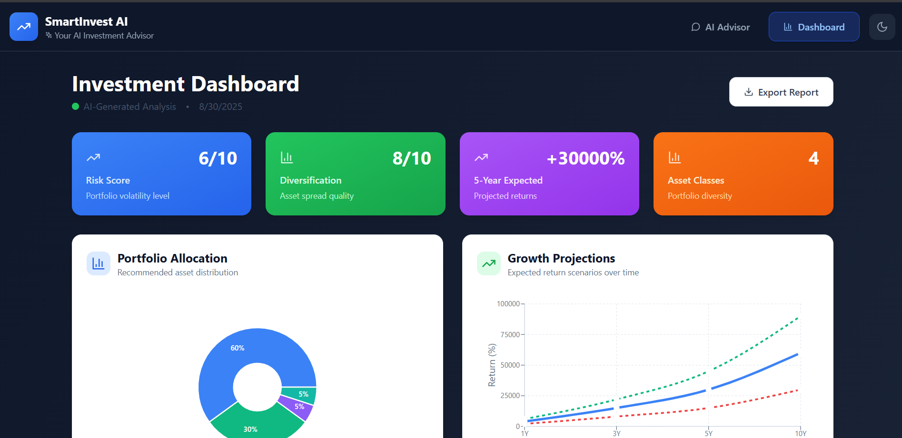

# 🚀 Smart Investment Advisor - AI-Powered Robo-Advisor

A comprehensive fintech application that provides personalized investment recommendations through AI-powered analysis. Built with React, Node.js, and Google Gemini AI integration.

## 🌐 Live Demo
**🔗 [Try the Live Application](https://smartinvestai-01.onrender.com/)**


*Project screenshot - replace with actual application interface*

## 🌟 Features

### 💬 AI-Powered Investment Chat
- **Natural Language Processing**: Chat with our AI advisor using plain English
- **Personalized Analysis**: Get recommendations based on age, risk tolerance, time horizon
- **Real-time Responses**: Instant portfolio suggestions with detailed explanations
- **Conversation History**: Track your investment discussions over time

### � Responsive Design
- **Mobile-First**: Optimized for all device sizes from phones to desktops
- **Touch-Friendly**: Large interactive elements for mobile devices
- **Adaptive Layout**: Smart grid systems that adjust to screen sizes
- **Dark Mode Support**: Seamless light/dark theme switching

### 📊 Professional Data Export
- **PDF-Ready Reports**: Comprehensive investment analysis reports
- **JSON Data Export**: Raw portfolio data for external analysis
- **Professional Formatting**: ASCII art headers and structured layout
- **Multi-Format Support**: Both .txt and .json file downloads
- **Portfolio Pie Chart**: Visual breakdown of recommended asset allocation
- **Growth Projections**: Multi-scenario return forecasts (1, 3, 5, 10 years)
- **Risk Meter**: Visual gauge showing portfolio risk level (1-10 scale)
- **Diversification Radar**: Multi-axis analysis of portfolio balance

### 📊 Interactive Dashboard
- **Portfolio Pie Chart**: Visual breakdown of recommended asset allocation
- **Growth Projections**: Multi-scenario return forecasts (1, 3, 5, 10 years)
- **Risk Meter**: Visual gauge showing portfolio risk level (1-10 scale)
- **Diversification Radar**: Multi-axis analysis of portfolio balance

### 🎯 Investment Analysis
- **Asset Allocation**: Precise percentages across stocks, bonds, ETFs, crypto, REITs
- **Risk Assessment**: Market volatility, liquidity, and inflation protection analysis
- **Investment Rationale**: Clear explanations for each recommendation
- **Export Capabilities**: Download and share your investment strategy

## 🛠️ Technology Stack

### Frontend
- **React 18+** with functional components and hooks
- **Tailwind CSS** for responsive design and styling
- **Framer Motion** for smooth animations and transitions
- **Recharts** for interactive data visualizations
- **React Router** for navigation between pages
- **Axios** for API communication

### Backend
- **Node.js** with Express framework
- **Google Gemini AI** integration for intelligent recommendations
- **CORS** enabled for cross-origin requests
- **Express middleware** for JSON parsing and error handling
- **Environment variables** for secure API key management

## 🚀 Quick Start

### Prerequisites
- Node.js 16+ installed on your system
- npm or yarn package manager
- Google Gemini API key (optional - app works with mock data)

### Installation

1. **Clone and Install Dependencies**
   ```bash
   npm install
   ```

2. **Environment Setup** (Optional for AI features)
   ```bash
   cp .env.example .env
   ```
   Add your Google Gemini API key to the `.env` file:
   ```
   GEMINI_API_KEY=your_gemini_api_key_here
   VITE_BACKEND_URL=http://localhost:3001
   PORT=3001
   ```

3. **Start Development Server**
   ```bash
   npm run dev
   ```

   This command starts both:
   - Frontend (React) server on `http://localhost:5173`
   - Backend (Express) API on `http://localhost:3001`

4. **Open Application**
   Navigate to `http://localhost:5173` in your browser

## 💡 Usage Examples

### Sample Investment Queries
Try these example inputs with the AI advisor:

**Aggressive Growth:**
```
"I'm 25 years old, want aggressive growth for retirement in 40 years, willing to take high risk"
```

**Conservative Income:**
```
"I need low-risk investments with steady income, I'm 55 and planning to retire in 10 years"
```

**Balanced Approach:**
```
"I have $50,000 to invest for 10 years, moderate risk tolerance, want growth but some safety"
```

**Short-term Investment:**
```
"I have $10,000 for 2 years, need it for a house down payment, can't afford to lose it"
```

## � Performance Optimization

- **Code Splitting**: Lazy loading for dashboard components
- **Image Optimization**: Optimized hero images from Pexels
- **Bundle Analysis**: Minimized JavaScript bundle size with Vite
- **Caching Strategy**: API response caching for repeated queries
- **Responsive Images**: Adaptive image loading for different screen sizes
- **Animation Performance**: Hardware-accelerated animations with Framer Motion

## 🔧 API Endpoints

### POST `/api/recommend`
Generate investment recommendation based on user input.

**Request:**
```json
{
  "userInput": "I'm 30, want moderate growth for retirement in 35 years"
}
```

**Response:**
```json
{
  "success": true,
  "data": {
    "portfolio": {
      "stocks": 60,
      "bonds": 25,
      "etfs": 10,
      "crypto": 5,
      "reits": 0,
      "commodities": 0
    },
    "rationale": {
      "stocks": "High allocation to growth stocks leverages your long time horizon...",
      "bonds": "Bond allocation provides stability and income generation..."
    },
    "riskScore": 6,
    "diversificationScore": 8,
    "projections": {
      "1year": { "conservative": 3, "expected": 7, "optimistic": 12 },
      "3year": { "conservative": 15, "expected": 22, "optimistic": 35 },
      "5year": { "conservative": 25, "expected": 45, "optimistic": 70 },
      "10year": { "conservative": 60, "expected": 120, "optimistic": 200 }
    },
    "riskAssessment": {
      "marketVolatility": "Moderate portfolio designed for steady growth...",
      "liquidityRisk": "High liquidity with minimal transaction costs...",
      "inflationProtection": "Growth assets historically outpace inflation..."
    },
    "timestamp": "2025-08-30T10:30:00Z",
    "userInput": "I'm 30, want moderate growth...",
    "isAI": true
  }
}
```

### GET `/api/health`
Check API status and AI availability.

**Response:**
```json
{
  "status": "healthy",
  "timestamp": "2025-08-30T10:30:00Z",
  "aiEnabled": true
}
```

### GET `/api/health`
Check API status and AI availability.

**Response:**
```json
{
  "status": "healthy",
  "timestamp": "2024-01-15T10:30:00Z",
  "aiEnabled": true
}
```

## 🎨 Design System

### Color Palette
- **Primary**: Blue (#3B82F6) - Trust, stability, financial growth
- **Success**: Green (#10B981) - Positive returns, growth
- **Warning**: Yellow (#F59E0B) - Moderate risk, attention
- **Error**: Red (#EF4444) - High risk, losses
- **Neutral**: Slate grays for text and backgrounds

### Typography
- **Headings**: Inter font family, 120% line height
- **Body Text**: 150% line height for optimal readability
- **Font Weights**: Regular (400), Medium (500), Bold (700)

### Spacing
- Consistent 8px grid system
- Component padding: 16px, 24px, 32px
- Card margins: 24px between elements

## 🏗️ Project Structure

```
src/
├── components/
│   ├── Header.tsx              # Navigation header with responsive design
│   ├── ChatInterface.tsx       # Main chat interface with mobile optimization
│   ├── RecommendationCard.tsx  # AI recommendation display
│   ├── TypingIndicator.tsx     # Chat typing animation
│   ├── Dashboard.tsx           # Portfolio dashboard with export features
│   ├── Toast.tsx               # Notification system for user feedback
│   └── charts/
│       ├── PortfolioPieChart.tsx
│       ├── GrowthProjectionChart.tsx
│       ├── RiskMeter.tsx
│       └── DiversificationRadar.tsx
├── context/
│   ├── RecommendationContext.tsx # Global state management
│   └── ThemeContext.tsx        # Dark/light theme management
├── services/
│   └── api.ts                  # API communication layer with error handling
├── App.tsx                     # Main app component with routing
└── main.tsx                    # App entry point

server/
└── index.js                   # Express API server with Gemini integration
```

## 🔐 Security & Privacy

- **API Key Security**: Environment variables for sensitive data
- **Input Validation**: Sanitization of user inputs before AI processing
- **Error Handling**: Graceful fallbacks when AI services are unavailable
- **CORS Configuration**: Proper cross-origin request handling

## 🚀 Deployment

### 🌐 Live Production
The application is deployed and accessible at:
**[https://smartinvestai-01.onrender.com/](https://smartinvestai-01.onrender.com/)**

### Frontend Deployment (Vercel/Netlify)
```bash
npm run build
```
Deploy the `dist` folder to your preferred hosting platform.

### Backend Deployment (Render/Railway)
```bash
npm run start:server
```
Set environment variables in your hosting platform dashboard:
- `GEMINI_API_KEY`: Your Google Gemini API key
- `PORT`: Server port (usually auto-set by hosting provider)
- `NODE_ENV`: Set to `production`

### Environment Variables for Production
```bash
GEMINI_API_KEY=your_gemini_api_key_here
PORT=3001
NODE_ENV=production
```

## 🧪 Testing

### Manual Testing Checklist
- [ ] Chat interface accepts and processes user input
- [ ] AI recommendations display correctly with charts
- [ ] Dashboard shows comprehensive portfolio analysis
- [ ] All charts render and update properly
- [ ] Responsive design works on mobile devices (phones, tablets)
- [ ] Error states display when API is unavailable
- [ ] Export functionality generates proper reports
- [ ] Dark/light theme switching works correctly
- [ ] Toast notifications appear for user actions

### API Testing
```bash
# Test recommendation endpoint
curl -X POST http://localhost:3001/api/recommend \
  -H "Content-Type: application/json" \
  -d '{"userInput": "I want aggressive growth for 20 years"}'

# Test health endpoint
curl http://localhost:3001/api/health
```

## 🤖 AI Integration Notes

### With Google Gemini API Key
- Real-time AI analysis using Google's Gemini 1.5 Flash model
- Personalized recommendations based on latest market insights
- Dynamic responses adapting to user context and risk preferences
- Advanced natural language processing for investment queries

### Without API Key
- Intelligent mock data system with realistic scenarios
- Pre-configured scenarios for common investment profiles
- Full functionality demonstration for development and testing

## 📈 Performance Optimization

- **Code Splitting**: Lazy loading for dashboard components
- **Image Optimization**: Optimized hero images from Pexels
- **Bundle Analysis**: Minimized JavaScript bundle size
- **Caching Strategy**: API response caching for repeated queries

## 🐛 Troubleshooting

### Common Issues

**Backend not starting:**
```bash
# Check if port 3001 is available
netstat -ano | findstr :3001
# If occupied, change PORT in .env file
```

**Charts not rendering:**
```bash
# Ensure recharts is properly installed
npm install recharts@latest
```

**API connection errors:**
- Verify backend is running on port 3001
- Check CORS configuration allows frontend origin
- Confirm `VITE_BACKEND_URL` environment variable is set correctly
- Ensure network connectivity between services

**Gemini API errors:**
- Verify `GEMINI_API_KEY` is set in environment variables
- Check API key has proper permissions
- Monitor API usage limits and quotas

## 🤝 Contributing

1. Fork the repository
2. Create feature branch: `git checkout -b feature/amazing-feature`
3. Commit changes: `git commit -m 'Add amazing feature'`
4. Push to branch: `git push origin feature/amazing-feature`
5. Open Pull Request

## 📄 License

MIT License - see LICENSE file for details.

## 🙏 Acknowledgments

- Google Gemini AI for intelligent investment recommendations
- Recharts for beautiful and responsive data visualizations
- Tailwind CSS for comprehensive responsive design system
- Framer Motion for smooth and performant animations
- Lucide React for clean and consistent iconography

---

**Built with ❤️ for the future of intelligent investing**